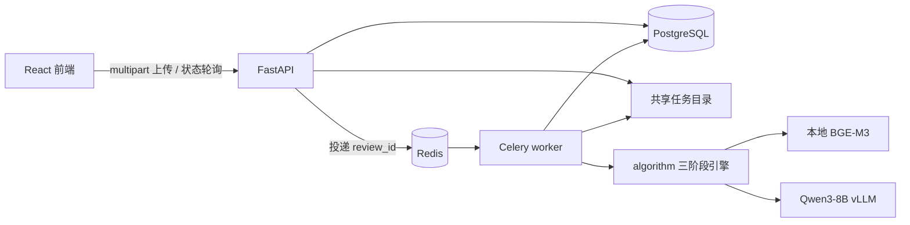
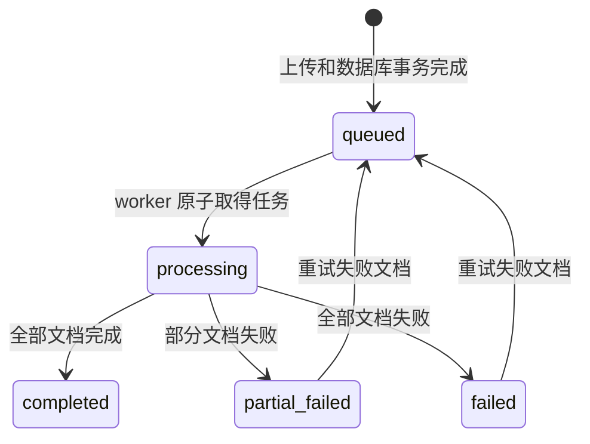

# IntelligentApproval 后端架构与运维手册

本文档面向后续开发者、Code Agent 和服务器运维人员。它描述的是当前实际代码，而不是未来设想。

## 1. 设计结论

后端固定使用 PostgreSQL、Redis/Celery 和 FastAPI，不提供 SQLite/MySQL 兼容分支。

选择 PostgreSQL 的原因是审批结果同时包含强结构化的任务状态和持续演进的嵌套算法数据。任务、文件、进度和审计字段使用普通列；`algorithm_result`、`matched_case` 和 `frontend_detail` 使用 JSONB。这样既保留算法原貌，又能按 JSON 路径进行后续审计分析。PostgreSQL 的事务和行级锁也用于保证 Celery 重复投递时只有一个 worker 能取得任务。

Redis 只承担 Celery broker/result backend，不作为业务真相来源。PostgreSQL 是任务状态的唯一真相来源；Redis 清空后，Celery beat 会重新投递仍处于 `queued` 的数据库记录。

大文件和算法中间产物不存入 PostgreSQL，而是放入 `STORAGE_ROOT`。单机部署时这是本地磁盘目录；多 worker 节点部署时必须是各节点路径一致的共享存储（例如 NFS）。



## 2. 代码边界

```text
backend/
├── app/
│   ├── api/routes/
│   │   ├── health.py            # 存活/就绪探针
│   │   └── reviews.py           # 上传、进度、结果、重试、报告下载
│   ├── services/
│   │   ├── algorithm_adapter.py # 直接调用现有算法，不经过 CLI
│   │   ├── result_mapper.py     # 算法 JSON -> 前端稳定契约
│   │   ├── review_service.py    # 查询、状态映射、汇总
│   │   ├── report_files.py      # 本次运行简报
│   │   └── storage.py           # 上传流、哈希和路径安全
│   ├── tasks/
│   │   ├── celery_app.py        # Celery 连接与周期任务
│   │   └── review_tasks.py      # 文档编排、恢复和结果入库
│   ├── config.py                # 从全局 runtime.env 读取并校验配置
│   ├── database.py              # SQLAlchemy engine/session
│   ├── models.py                # PostgreSQL 模型
│   ├── schemas.py               # 对外 API 契约
│   └── main.py                  # ASGI 入口 app.main:app
├── migrations/                  # Alembic 迁移
├── tests/                       # 不依赖外部服务的契约测试
└── requirements.txt

config/
└── runtime.env.example          # 全项目唯一运行配置模板

scripts/lib/
└── load_runtime_config.sh       # 所有 shell 入口共用的配置加载器
```

算法仍归 `algorithm/` 所有。后端不得复制算法实现，也不得调用会清空根目录 `reports/` 的 `algorithm/main.py`。`AlgorithmAdapter` 直接调用：

1. `src.cont_match.prepare_case()`：完成文档提取、章节拆分、混合召回和可选 LLM 重排；
2. `src.engine.run_case()`：完成结构化/语义校验、解释、缓存和可选复核；
3. `src.rule_check.report`：保存算法原始 JSON 与详细 Markdown。

每个文档拥有独立的 `work` 和 `decision_cache`，并发任务不会覆盖彼此。

## 3. PostgreSQL 数据模型

### reviews

一行表示前端发起的一次审批，可以包含 1 至 10 份文档。

关键字段：

- `status/stage/progress`：任务状态机；
- `total_documents/completed_documents/failed_documents`：批量进度；
- `policy_rules_path/policy_rules_sha256`：创建任务时的规则快照和校验哈希；worker 运行前会重新计算哈希，不一致时拒绝审批；
- `error_message`：任务级可展示错误；
- `created_at/started_at/completed_at/updated_at`：审计时间。

### review_documents

一行表示任务内的一份文件。

关键字段：

- `original_filename/stored_filename/file_extension/file_size/file_sha256`；
- `input_path/work_path`：相对于该 review 根目录的路径；
- `status/stage/progress/error_message`；
- `algorithm_result`：`ApprovalReport.to_dict()` 原始 JSONB；
- `matched_case`：步骤一、二生成的正式匹配 JSONB；
- `frontend_detail`：经过安全字段白名单转换后的页面详情 JSONB。

当前迁移为 `backend/migrations/versions/20260815_0001_initial.py`。禁止在生产库使用 `Base.metadata.create_all()`；所有结构修改必须新增 Alembic migration。

## 4. 文件目录协议

一次任务的目录如下：

```text
STORAGE_ROOT/<review_uuid>/
├── policy_rules/<policy_rules.json>   # 创建任务时快照
├── summary.json                       # 前端汇总契约
├── summary_brief.md                   # 本次运行执法简报
└── documents/<document_uuid>/
    ├── input/<原始文件名>
    └── work/
        ├── algorithm.log
        ├── task-error.log              # 仅任务异常时出现
        ├── matched/rules_matched.json
        ├── preprocessing/
        │   ├── outline.json
        │   ├── sections.json
        │   ├── matches.json
        │   └── manifest.json
        ├── decision_cache/
        └── results/
            ├── summary.json            # 算法原始详细报告
            ├── summary.md              # 人读详细报告
            └── frontend_detail.json    # API 详情契约
```

数据库中只保存相对路径，代码在读取时使用 `ensure_within()` 再次校验路径必须位于任务根目录，防止路径穿越。

## 5. 生命周期与幂等性

### 任务状态



公开接口把内部 `partial_failed` 映射为 `completed`，因此前端会进入结果页，并通过 `failedDocuments` 展示部分失败；内部状态仍完整保留。

Celery 可能重复投递消息。`run_review` 首先锁定 `reviews` 行，只有状态为 `queued` 的任务才会切换到 `processing` 并执行；其他投递直接退出。

API 在 PostgreSQL 提交后才向 Redis 投递，二者之间存在很窄的进程崩溃窗口。唯一的 Celery beat 每分钟扫描数据库中超过 30 秒仍为 `queued` 的任务并重新投递。`acks_late`、`worker_prefetch_multiplier=1` 和 `task_reject_on_worker_lost` 用于减少 worker 意外退出造成的任务丢失。

如果 worker 在执行过程中直接消失，任务可能停留在 `processing`。beat 每 5 分钟检查一次，超过 `TASK_STALE_AFTER_MINUTES`（默认 360 分钟）未更新的任务会回到队列。该值必须大于正常单任务最长耗时，避免仍存活的任务被重复执行。

## 6. API 契约

所有业务接口前缀默认为 `/api`。错误统一返回：

```json
{
  "error": {
    "code": "REVIEW_NOT_READY",
    "message": "审查尚未完成",
    "details": {"status": "processing", "progress": 45},
    "requestId": "..."
  }
}
```

### 创建任务

`POST /api/reviews`

`multipart/form-data` 中重复使用 `documents` 字段。成功返回 HTTP 202：

```json
{"id":"review-uuid","mode":"live","status":"queued"}
```

支持 `.pdf .doc .docx .docm .odt .rtf .wps .txt .md`；默认最多 10 份、每份 30 MiB。后端以流式方式写入 `.uploading` 临时文件，完成大小校验和 SHA-256 后原子改名。

### 查询进度

`GET /api/reviews/{review_id}/status`

返回任务进度、内部状态和每份文档进度。前端 Processing 页面每 1.5 秒轮询；`completed` 后进入总览，`failed` 后停留并显示错误。

### 查询汇总

`GET /api/reviews/{review_id}`

任务未完成时返回 409；终态返回 `ReviewSummary`。算法状态映射如下：

| 算法状态 | 前端状态 |
|---|---|
| `violation` | `violation` |
| `warning` | `warning` |
| `pass` | `passed` |
| `insufficient_input` | `insufficient` |
| `error` | `insufficient`，同时累计 `executionFailed` |

### 查询文件详情

`GET /api/reviews/{review_id}/documents/{document_id}`

`result_mapper.py` 只向前端输出明确白名单字段：结论、LLM 分析、法规依据、证据双页码、命中原文、缺失输入、置信度和有限结构化指标。缓存键、原始模型响应、堆栈和内部路径不会进入前端契约。

### 重试

`POST /api/reviews/{review_id}/retry`

仅重新排队状态为 `failed` 的文档，已完成文档和自己的判定缓存保持不变。运行中的任务返回 409。

### 下载报告

- `GET /api/reviews/{review_id}/artifacts/brief`
- `GET /api/reviews/{review_id}/artifacts/summary`
- `GET /api/reviews/{review_id}/documents/{document_id}/artifacts/report`
- `GET /api/reviews/{review_id}/documents/{document_id}/artifacts/algorithm-result`
- `GET /api/reviews/{review_id}/documents/{document_id}/artifacts/matched`
- `GET /api/reviews/{review_id}/documents/{document_id}/artifacts/log`
- `GET /api/reviews/{review_id}/documents/{document_id}/artifacts/error-log`

后四类文件主要用于服务器调试和审计，不应通过公网网关直接开放给普通终端用户。

### 探针

- `GET /api/health/live`：进程存活；
- `GET /api/health/ready`：同时检查 PostgreSQL、Redis、算法目录和配置的规则文件。

OpenAPI UI 位于 `/docs`，机器契约位于 `/openapi.json`。

## 7. 服务器部署

### 7.1 Python 与系统依赖

建议沿用现有 Python 3.10+ 的 `approval` Conda 环境：

```bash
conda activate approval
pip install -r requirements.txt
```

Office 文档转换依赖系统 `libreoffice`/`soffice`。扫描 PDF 当前仍不包含 OCR；没有可提取文字时文档会失败并写入 `task-error.log`。

### 7.2 PostgreSQL 与 Redis

开发机可以运行：

```bash
bash scripts/backend/run_infrastructure.sh
```

生产环境应使用企业维护的 PostgreSQL 与 Redis 实例。数据库账号至少需要目标 schema 的建表（迁移阶段）和增删改查权限；运行期可将迁移账号与应用账号分离。Redis 应开启持久化、访问控制和内网限制。

### 7.3 配置

```bash
bash scripts/setup_runtime_config.sh
# 然后只编辑 config/runtime.env
```

生产环境必须逐项修改：

- `DATABASE_URL`、`REDIS_URL`；
- `STORAGE_ROOT`；
- `POLICY_RULES_PATH`、`ALGORITHM_ROOT`；
- `CORS_ORIGINS`；
- `LOCAL_LLM_BASE_URL`、`LOCAL_LLM_MODEL`、`LOCAL_EMBED_MODEL`；
- 算法并发与超时参数。

所有后端、Celery、算法、vLLM、基础设施和前端启动脚本都会自动加载这个文件，不需要在终端执行
`export`。配置值采用受信任的 Bash 赋值语法；路径含空格时必须使用双引号。`config/runtime.env` 已被
Git 忽略且初始化权限为 `600`，不要提交数据库密码等机密信息。

### 7.4 启动顺序

```bash
# 1. 启动开发 PostgreSQL/Redis，或确认企业实例已就绪
bash scripts/backend/run_infrastructure.sh

# 2. 启动并检查 vLLM
bash scripts/algorithm/serve_vllm_qwen3_8b.sh
bash scripts/algorithm/check_vllm.sh

# 3. 数据库迁移
bash scripts/backend/migrate.sh

# 4. 分别由进程管理器启动
bash scripts/backend/run_api.sh
bash scripts/backend/run_worker.sh
bash scripts/backend/run_beat.sh
```

单机首次联调可用：

```bash
bash scripts/backend/run_backend.sh
```

后端依赖检查：

```bash
bash scripts/backend/check_services.sh
```

### 7.5 并发建议

`CELERY_WORKER_CONCURRENCY` 默认 1。算法自身已经通过 `MATCHING_WORKERS` 和 `SEMANTIC_WORKERS` 并发调用 vLLM；盲目提高 Celery 进程数会让每个进程各自加载一份 embedding 模型并增加内存占用。先保持一个 Celery 进程，根据任务排队长度、CPU 内存和 vLLM 吞吐再增加独立 worker 实例。

API 是无状态的，可用 `BACKEND_API_WORKERS` 增加进程数。API/worker 必须使用同一 PostgreSQL、Redis、配置和 `STORAGE_ROOT`。

集群只能运行一个 Celery beat，否则会产生额外重复投递；任务幂等锁可以阻止重复执行，但不应依赖它掩盖错误部署。

## 8. 本地无 vLLM 验证

将下列配置写入 `config/runtime.env`：

```dotenv
ALGORITHM_USE_EMBEDDING=false
ALGORITHM_USE_LLM_MATCHING=false
ALGORITHM_STRICT_LLM=false
ALGORITHM_ENABLE_LLM_CHECK=false
```

然后可以验证完整基础设施和步骤一/二的字符召回路径。此模式下语义规则会输出 `insufficient_input`，这是预期行为。

不启动任何外部服务也能运行：

```bash
PYTHONPATH=backend python -m unittest discover -s backend/tests -v
python -m compileall -q backend
cd frontend && npm run build
```

当前纯逻辑测试覆盖：上传文件名清洗、扩展名限制、路径穿越、算法结果映射、执行失败计数和 Markdown 简报。

## 9. 排障

### 任务一直 queued

1. 请求 `/api/health/ready`；
2. 检查 Redis；
3. 检查 worker 是否注册了 `approval.run_review`；
4. 检查 beat 是否运行；beat 会重新投递 queued 记录。

### 任务一直 processing

检查对应文档的 `algorithm.log`、worker 日志以及 vLLM 请求。worker 硬退出后，超过 `TASK_STALE_AFTER_MINUTES` 会自动重新排队。不要把该阈值设置得短于正常最长推理时间。

### 某个文档 failed

查看 `task-error.log`。修复模型、LibreOffice、文件权限或输入问题后调用 `POST /api/reviews/{id}/retry`。仅失败文档会重跑。

### API 有结果但 Markdown 下载 404

PostgreSQL 是真相来源，这通常说明终态写文件时共享存储短暂失败。先修复挂载和权限，再重新请求下载接口；后端会根据 PostgreSQL 中的结果自动补写运行级 JSON 和简报。单文档详细报告由算法阶段写入。

### vLLM 不在 Celery 使用的 GPU 上

GPU 归 vLLM 进程管理。后端只访问 `LOCAL_LLM_BASE_URL`，不直接选择 vLLM GPU。修改统一配置中的 `LLM_CUDA_VISIBLE_DEVICES` 后重启 vLLM 即可；API 和 Celery 无需再次指定同一 GPU。

## 10. 安全与运维边界

- 当前服务定位为企业内网应用，身份认证应由企业 SSO/API 网关或反向代理统一完成；不要把 API 直接暴露到公网。
- 上传扩展名、大小、数量和路径已经校验，但生产网关仍应限制请求体并进行恶意文件扫描。
- `STORAGE_ROOT` 包含原始招标文件，必须设置最小文件权限、加密磁盘、备份和生命周期清理策略。
- PostgreSQL 备份和共享文件目录快照必须成对规划；数据库路径指向文件产物。
- API 的 `X-Request-ID` 会写入响应和访问日志，用于关联网关日志。
- 算法结论只用于辅助执法人员审查，页面已经保留人工复核提示，不应把模型结果作为无人复核的最终行政决定。

## 11. 后续修改原则

1. 前端契约变化先修改 `schemas.py` 和 `result_mapper.py`，不要让页面直接依赖算法原始 JSON。
2. 算法字段变化优先保持原始 JSON，再在 mapper 中兼容；不要在 Celery task 中散落字段映射。
3. 新数据库字段必须新增 Alembic migration。
4. 不要把 `algorithm/main.py` 接进 Web 任务；它会管理全局 `reports/`，不适合并发服务。
5. 不要在 API 请求线程里运行算法；所有核心处理必须由 Celery worker 执行。
6. 不要把 Redis 当作审批结果数据库。
7. 增加 worker 数量前先测量 embedding 内存和 vLLM 并发吞吐。
